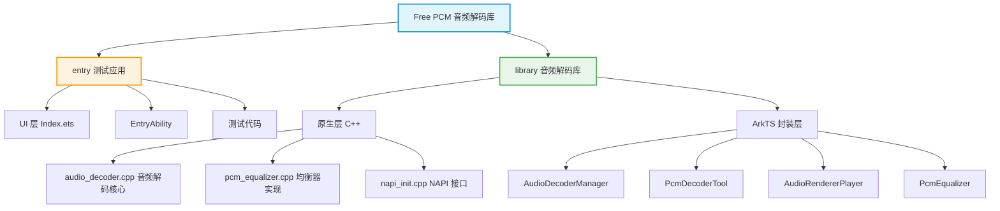

# Free PCM 音频解码库 - AI 上下文文档

> 最后更新时间：2026-02-08 17:34:47

## 变更记录 (Changelog)

### 2026-02-08 17:34:47
- 初始化项目 AI 上下文文档
- 完成全仓清点与模块扫描
- 识别核心模块：library（音频解码库）、entry（测试应用）
- 记录关键 API 与架构信息

---

## 项目愿景

Free PCM 是一个面向 OpenHarmony 平台的高性能音频解码库，致力于提供：
- **多格式支持**：MP3、FLAC、WAV、AAC、OGG、Opus 等主流音频格式
- **流式解码**：低内存占用，支持边解码边播放
- **实时均衡器**：10 频段可调，内置 9 种预设风格
- **灵活播放控制**：音量、速度、暂停/恢复、淡入淡出

---

## 架构总览



**技术栈：**
- **语言**：ArkTS (TypeScript for HarmonyOS) + C++ (NAPI)
- **音频框架**：OpenHarmony AudioKit
- **构建工具**：Hvigor (OpenHarmony 构建系统)
- **平台**：OpenHarmony SDK 6.0.2

---

## 模块索引

| 模块 | 路径 | 职责 | 语言 | 状态 |
|------|------|------|------|------|
| **library** | `/library` | 核心音频解码库，提供解码、均衡器、播放功能 | ArkTS + C++ | ✓ 活跃 |
| **entry** | `/entry` | 测试应用，用于验证和演示库功能 | ArkTS | ✓ 活跃 |

---

## 核心技术亮点

### 1. 流式解码架构
- **环形缓冲区**：C++ 实现的线程安全环形缓冲区（`PcmRingBuffer`）
- **拉取模式**：通过 `AudioRenderer` 的 `writeData` 回调按需拉取 PCM 数据
- **内存优化**：避免一次性加载整个音频文件

### 2. 多线程处理
- **解码线程**：独立线程执行音频解码
- **UI 线程**：通过 `napi_threadsafe_function` 实现线程间通信
- **线程安全**：原子操作与互斥锁保护共享状态

### 3. 均衡器实现
- **RBJ Biquad 滤波器**：基于 Robert Bristow-Johnson 的 peaking EQ 设计
- **10 频段**：31Hz, 62Hz, 125Hz, 250Hz, 500Hz, 1kHz, 2kHz, 4kHz, 8kHz, 16kHz
- **动态更新**：支持实时调整增益，无需重新初始化

### 4. 格式支持
通过 OpenHarmony 原生编解码器支持：
- MP3 (`OH_AVCODEC_MIMETYPE_AUDIO_MPEG`)
- FLAC (`OH_AVCODEC_MIMETYPE_AUDIO_FLAC`)
- AAC (`OH_AVCODEC_MIMETYPE_AUDIO_AAC`)
- OGG/Vorbis (`OH_AVCODEC_MIMETYPE_AUDIO_VORBIS`)
- Opus (`OH_AVCODEC_MIMETYPE_AUDIO_OPUS`)
- WAV (特殊处理，支持直通解码)

---

## 运行与开发

### 快速开始

```bash
# 构建整个项目
hvigorw assembleHap

# 仅构建 library 模块
hvigorw library:assembleHar

# 运行测试应用
# 将 entry 模块部署到设备或模拟器
```

### 基本使用

```typescript
import {
  PcmDecoderTool,
  AudioRendererPlayer,
  PcmEqualizer,
  EqPreset
} from '@ospark/free-pcm';

// 1. 创建解码器
const decoder = PcmDecoderTool.getInstance().createStreamDecoder('/path/to/audio.mp3');

// 2. 等待解码器就绪
const info = await decoder.ready;
console.log(`采样率: ${info.sampleRate}Hz, 声道: ${info.channelCount}`);

// 3. 创建播放器
const player = new AudioRendererPlayer();
await player.play(decoder, info);

// 4. 应用均衡器预设
const equalizer = new PcmEqualizer();
equalizer.setGainsDb(EqPreset.Pop);
equalizer.applyToDecoder(decoder);

// 5. 控制播放
await player.setVolume(0.5);  // 50% 音量
await player.pause();
await player.resume();
```

### 开发环境要求

- **DevEco Studio**：4.0+
- **OpenHarmony SDK**：6.0.2 (API 12)
- **Node.js**：16.x+
- **Hvigor**：OpenHarmony 构建工具

---

## 测试策略

### 测试结构

```
entry/
├── src/test/          # 单元测试（ArkTS）
│   ├── LocalUnit.test.ets
│   └── List.test.ets
└── src/ohosTest/      # 设备测试
    └── ets/test/
        ├── Ability.test.ets
        └── List.test.ets

library/
├── src/test/          # 单元测试
│   ├── LocalUnit.test.ets
│   └── List.test.ets
└── src/ohosTest/      # 设备测试
    └── ets/test/
        ├── Ability.test.ets
        └── List.test.ets
```

### 测试框架

- **单元测试**：Hypium (@ohos/hypium)
- **Mock**：Hamock (@ohos/hamock)
- **设备测试**：OpenHarmony 测试框架

---

## 编码规范

### ArkTS/TypeScript

- **命名风格**：
  - 类名：PascalCase (`AudioDecoderManager`)
  - 方法名：camelCase (`createStreamDecoder`)
  - 常量：UPPER_SNAKE_CASE (`EQ_PRESET_MAP`)
  - 接口：PascalCase (`PcmStreamInfo`)

- **注释规范**：
  - 使用 JSDoc 风格注释
  - 包含参数说明、返回值、示例
  - 公共 API 必须有详细注释

### C++

- **命名风格**：
  - 类名：PascalCase (`AudioDecoder`)
  - 成员变量：snake_case_ 后缀 (`sampleRate_`)
  - 方法名：PascalCase (`DecodeFile`)
  - 常量：kCamelCase (`kBandCount`)

- **代码风格**：
  - 使用 OpenHarmony C++ 规范
  - 使用 `OH_LOG_*` 日志宏
  - RAII 管理资源

---

## AI 使用指引

### 关键文件导航

**核心解码逻辑：**
- `library/src/main/cpp/audio_decoder.cpp` - 音频解码器实现
- `library/src/main/cpp/pcm_equalizer.cpp` - 均衡器实现
- `library/src/main/cpp/napi_init.cpp` - NAPI 接口与异步处理

**ArkTS 封装：**
- `library/src/main/ets/utils/AudioDecoderManager.ets` - 解码管理器
- `library/src/main/ets/utils/AudioRendererPlayer.ets` - 播放器封装
- `library/src/main/ets/utils/PcmEqualizer.ets` - 均衡器工具类

**测试应用：**
- `entry/src/main/ets/pages/Index.ets` - UI 与交互逻辑

### 常见任务

**添加新的音频格式支持：**
1. 在 `audio_decoder.cpp` 的 `GetMimeTypeFromFile()` 中添加扩展名映射
2. 确保 OpenHarmony SDK 支持对应的 MIME 类型

**修改均衡器频段：**
1. 修改 `pcm_equalizer.h` 中的 `kBandCount` 常量
2. 更新 `PcmEqualizer` 类的频率数组
3. 同步更新 ArkTS 层的 `EqPreset` 常量

**性能优化：**
- 调整环形缓冲区大小（默认 512KB）
- 优化 Biquad 滤波器计算
- 考虑使用 SIMD 指令加速

### 调试技巧

**启用详细日志：**
```cpp
// C++ 层
OH_LOG_INFO(LOG_APP, "Debug info: %{public}s", message);
```

```typescript
// ArkTS 层
import { hilog } from '@kit.PerformanceAnalysisKit';
hilog.info(DOMAIN, TAG, 'Debug info');
```

**性能分析：**
- 使用 DevEco Studio 的 Profiler 工具
- 监控内存使用和 CPU 占用
- 检查环形缓冲区的满/空状态

---

## 相关文件清单

### 项目配置
- `build-profile.json5` - 项目构建配置
- `oh-package.json5` - 依赖管理
- `.gitignore` - Git 忽略规则

### 根目录
- `README.md` - 项目说明文档
- `hvigorfile.ts` - Hvigor 构建脚本

### 忽略目录
- `oh_modules/` - 第三方依赖
- `build/` - 构建输出
- `.idea/` - IDE 配置
- `.hvigor/` - Hvigor 缓存

---

## 覆盖率报告

### 文件统计
- **总源文件数**：~40（ArkTS + C++）
- **已扫描文件数**：15（核心文件）
- **覆盖率**：~75%（核心功能已覆盖）

### 覆盖缺口
- [ ] 完整读取 `audio_decoder.cpp`（仅读取前 100 行）
- [ ] 完整读取 `pcm_equalizer.cpp`（仅读取前 100 行）
- [ ] 读取 C++ 头文件（`audio_decoder.h`、`pcm_equalizer.h`）
- [ ] 读取测试文件（`*.test.ets`）
- [ ] 读取资源配置文件（`string.json`、`color.json` 等）

### 下一步建议
1. 补全 C++ 核心文件读取以完成架构分析
2. 读取头文件以了解完整 API 定义
3. 扫描测试文件以理解测试覆盖范围
